# AKS Network Architecture

This document provides a comprehensive overview of the network architecture for the `demo-aks` Azure Kubernetes Service cluster.

## 🗺️ Network Topology

```mermaid
   graph TB
       %% Internet and External Access
       Internet[🌐 Internet]
       %% Azure Region
       subgraph Azure["☁️ Azure West US Region"]
           %% Resource Groups
           subgraph RG1["📁 demo-aks-rg"]
               AKS[🎯 demo-aks<br/>AKS Cluster<br/>Free Tier]
               LogWS[📊 demo-workspace<br/>Log Analytics]
               DCR[📋 MSCI-westus-demo-aks<br/>Data Collection Rule]
           end
           subgraph RG2["📁 MC_demo-aks-rg_demo-aks_westus<br/>(Node Resource Group)"]
               %% Virtual Network
               subgraph VNet["🌐 aks-vnet-41067869<br/>10.224.0.0/12"]
                   %% Subnets
                   subgraph Subnet1["🔗 aks-subnet<br/>10.224.0.0/16"]
                       Node1[🖥️ vmss000000<br/>10.224.0.4<br/>Standard_D2s_v4]
                       Node2[🖥️ vmss000001<br/>10.224.0.33<br/>Standard_D2s_v4]
                   end
                   subgraph Subnet2["🔗 aks-appgateway<br/>10.238.0.0/24"]
                       AppGW[🚪 Application Gateway<br/>]
                   end
                   subgraph Subnet3["🔗 aks-virtualkubelet<br/>10.239.0.0/16"]
                       VK[🤖 Virtual Kubelet<br/>]
                   end
               end
               %% Load Balancer
               LB[⚖️ Standard Load Balancer<br/>Backend Pool: NodeIP]
               PubIP[🌍 Public IP<br/>95674564-6a43-4aaa-8942-f74b02128472]
           end
           %% Service Network
           subgraph ServiceNet["🔧 Service Network<br/>10.0.0.0/16"]
               DNS[🔍 CoreDNS<br/>10.0.0.10]
               Services[🔗 Kubernetes Services<br/>ClusterIP Range]
           end
       end
       %% Pod Network (Azure CNI)
       subgraph PodNet["🐳 Pod Network<br/>(Azure CNI)"]
           Pod1[📦 System Pods<br/>Node 1: 11 pods]
           Pod2[📦 System Pods<br/>Node 2: 19 pods]
       end
       %% Network Policies
       subgraph NetPol["🛡️ Network Security"]
           AzureNP[🔒 Azure Network Policy<br/>Enabled]
           NSG[🛡️ Network Security Groups<br/>Auto-managed]
       end
       %% Connections
       Internet --> PubIP
       PubIP --> LB
       LB --> Node1
       LB --> Node2
       Node1 --> Pod1
       Node2 --> Pod2
       Pod1 --> DNS
       Pod2 --> DNS
       DNS --> Services
       Node1 --> LogWS
       Node2 --> LogWS
       DCR --> LogWS
       AzureNP --> Subnet1
       NSG --> VNet
       %% Styling
       classDef azure fill:#0078d4,stroke:#005a9e,stroke-width:2px,color:#fff
       classDef network fill:#00bcf2,stroke:#0078d4,stroke-width:2px,color:#fff
       classDef compute fill:#ff6b35,stroke:#e55100,stroke-width:2px,color:#fff
       classDef security fill:#7b68ee,stroke:#483d8b,stroke-width:2px,color:#fff
       classDef storage fill:#32cd32,stroke:#228b22,stroke-width:2px,color:#fff
       class Azure,RG1,RG2 azure
       class VNet,Subnet1,Subnet2,Subnet3,ServiceNet,PodNet network
       class Node1,Node2,Pod1,Pod2,LB compute
       class NetPol,AzureNP,NSG security
       class LogWS,DCR storage
```

## 📋 Network Configuration Summary

### Virtual Network Details
| Component | Value | Description |
|-----------|-------|-------------|
| **VNet Name** | `aks-vnet-41067869` | Auto-generated by AKS |
| **Address Space** | `10.224.0.0/12` | 16,777,216 available addresses |
| **Location** | `West US` | Azure region |
| **Resource Group** | `MC_demo-aks-rg_demo-aks_westus` | Node resource group |

### Subnet Configuration
| Subnet | CIDR | Purpose | Available IPs |
|--------|------|---------|---------------|
| **aks-subnet** | `10.224.0.0/16` | Worker nodes | 65,536 |
| **aks-appgateway** | `10.238.0.0/24` | Application Gateway (reserved) | 256 |
| **aks-virtualkubelet** | `10.239.0.0/16` | Virtual Kubelet (reserved) | 65,536 |

### Service Network
| Component | CIDR/IP | Description |
|-----------|---------|-------------|
| **Service CIDR** | `10.0.0.0/16` | Kubernetes services network |
| **DNS Service IP** | `10.0.0.10` | CoreDNS cluster IP |
| **IP Families** | `IPv4` | Single-stack IPv4 |

## 🌍 External Connectivity

### Load Balancer
- **Type**: Standard Load Balancer
- **Backend Pool**: Node IP Configuration
- **Outbound IPs**: 1 managed public IP
- **Public IP**: `95674564-6a43-4aaa-8942-f74b02128472`

### Outbound Configuration
- **Type**: Load Balancer
- **Managed Outbound IPs**: 1
- **Backend Pool Type**: nodeIPConfiguration

## 🔌 Network Plugin Configuration

### Azure CNI
- **Network Plugin**: `azure`
- **Network Policy**: `azure`
- **Network Data Plane**: `azure`
- **Pod Networking**: Direct VNet integration
- **IP Assignment**: Pods get IPs from VNet address space

### Benefits of Azure CNI
- ✅ Pods get real VNet IP addresses
- ✅ Direct connectivity to VNet resources
- ✅ Better performance (no NAT)
- ✅ Native Azure network policy support
- ✅ Integration with Azure networking services

## 🛡️ Security Configuration

### Network Policies
- **Engine**: Azure Network Policy
- **Status**: Enabled
- **Scope**: Pod-to-pod communication control
- **Integration**: Native Azure networking

### Network Security Groups (NSGs)
- **Management**: Auto-managed by AKS
- **Scope**: Subnet-level security rules
- **Updates**: Automatic with AKS operations

### Private Endpoints
- **Status**: Disabled (public cluster)
- **Node Subnet**: Public endpoints enabled
- **Service Subnet**: Public endpoints enabled

## 🔧 DNS Configuration

### CoreDNS
- **Service IP**: `10.0.0.10`
- **Replicas**: 2 (high availability)
- **Autoscaling**: Enabled
- **Custom Domains**: Configurable via ConfigMap

### DNS Resolution Flow
1. Pod → CoreDNS (`10.0.0.10`)
2. CoreDNS → Upstream DNS (Azure DNS)
3. External domains → Internet DNS

## 📚 Additional Resources

- [Azure CNI Documentation](https://docs.microsoft.com/en-us/azure/aks/configure-azure-cni)
- [AKS Network Concepts](https://docs.microsoft.com/en-us/azure/aks/concepts-network)
- [Azure Network Policy](https://docs.microsoft.com/en-us/azure/aks/use-network-policies)
- [AKS Load Balancer](https://docs.microsoft.com/en-us/azure/aks/load-balancer-standard)
